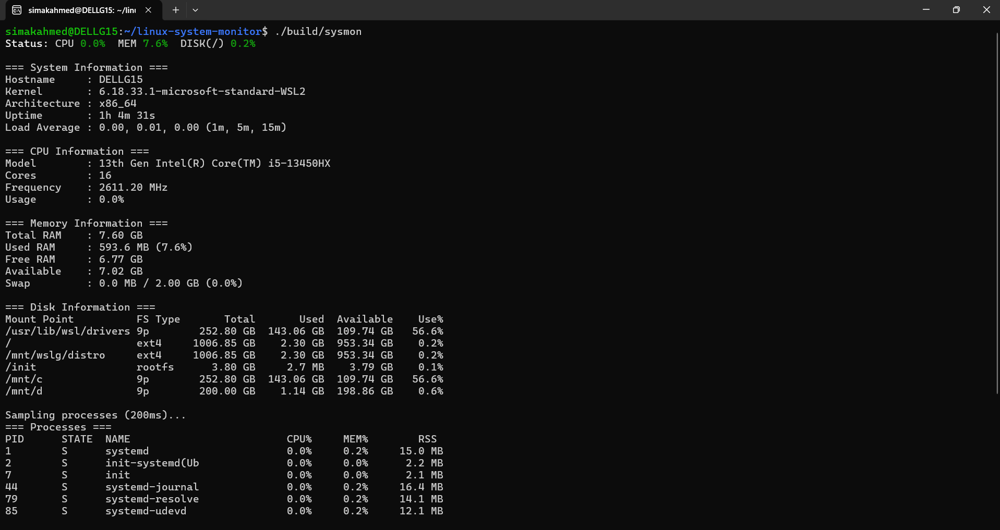
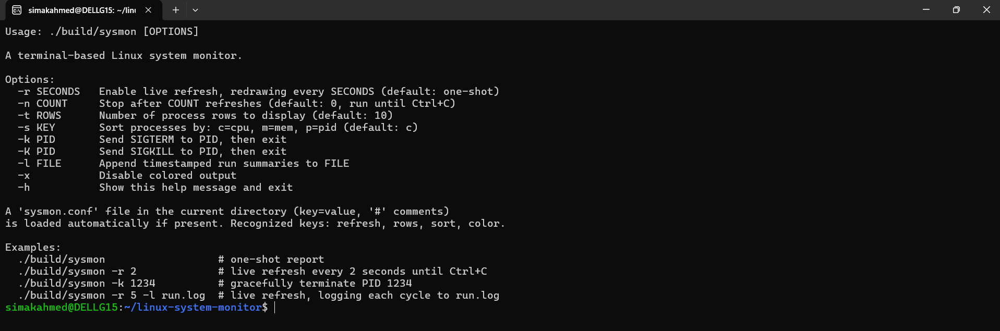

# Linux System Monitor


A modular terminal-based Linux system monitor written entirely in **C**, built as a systems programming portfolio project. Inspired by tools like **top** and **htop**, it collects real-time system information directly from the Linux kernel using the **/proc** and **/sys** filesystems together with **POSIX APIs**, without relying on third-party libraries.

The project demonstrates low-level Linux programming concepts including process management, filesystem parsing, terminal applications, signals, logging, configuration handling, and modular software design.

---

## Features

- ✅ System Information
- ✅ CPU Monitoring
- ✅ Memory Monitoring
- ✅ Disk Monitoring
- ✅ Process Monitoring
- ✅ Network Monitoring
- ✅ Logged-in Users
- ✅ Live Refresh Mode
- ✅ Command-Line Interface
- ✅ ANSI Colored Output
- ✅ Configuration File Support
- ✅ Timestamped Logging
- ✅ Process Control (SIGTERM / SIGKILL)
- ✅ Modular Architecture
- ✅ Zero Compiler Warnings (`-Wall -Wextra -Werror`)
- ✅ Compatible with Linux and WSL2

---

## Screenshots

### Main Dashboard

Displays real-time system information including CPU, memory, disk, processes, network interfaces, and logged-in users.



---

### Command-Line Interface

Shows all supported command-line options for live refresh, sorting, logging, configuration, and process management.



---

# Technologies Used

- C17
- POSIX APIs
- Linux `/proc` filesystem
- Linux `/sys` filesystem
- GNU Make
- GCC
- ANSI Escape Codes

---

# Project Structure

```text
linux-system-monitor/
│
├── docs/
│   ├── screenshot-main.png
│   └── screenshot-help.png
│
├── include/
│   ├── cli.h
│   ├── color.h
│   ├── config.h
│   ├── cpu.h
│   ├── disk.h
│   ├── log.h
│   ├── mem.h
│   ├── net.h
│   ├── process.h
│   ├── sysinfo.h
│   └── users.h
│
├── modules/
│   ├── cli.c
│   ├── color.c
│   ├── config.c
│   ├── cpu.c
│   ├── disk.c
│   ├── log.c
│   ├── mem.c
│   ├── net.c
│   ├── process.c
│   ├── sysinfo.c
│   └── users.c
│
├── src/
│   └── main.c
│
├── build/
├── Makefile
├── LICENSE
├── .gitignore
└── README.md
```

---

# Requirements

- Linux (or WSL2)
- GCC with C17 support
- GNU Make

---

# Building

Clone the repository:

```bash
git clone https://github.com/SamRepository25/Linux-System-Monitor.git
cd Linux-System-Monitor
```

Build:

```bash
make
```

Clean build artifacts:

```bash
make clean
```

---

# Usage

Run the monitor:

```bash
./build/sysmon
```

Show help:

```bash
./build/sysmon -h
```

---

# Command-Line Options

| Option | Description |
|---------|-------------|
| `-h` | Show help message |
| `-r <seconds>` | Enable live refresh mode |
| `-n <count>` | Stop after a specified number of refreshes |
| `-t <rows>` | Number of process rows to display |
| `-s <c/m/p>` | Sort processes by CPU, memory, or PID |
| `-k <PID>` | Send SIGTERM to a process |
| `-K <PID>` | Send SIGKILL to a process |
| `-l <file>` | Append timestamped summaries to a log file |
| `-x` | Disable colored output |

---

# Configuration File

The monitor automatically loads a `sysmon.conf` file if present.

Example:

```text
refresh=2
rows=10
sort=m
color=off
```

Configuration precedence:

```text
Built-in Defaults
        ↓
sysmon.conf
        ↓
Command-Line Arguments
```

---

# Example Output

```text
Status: CPU 4.1% MEM 32.8% DISK(/) 56.4%

=== System Information ===
Hostname      : DELLG15
Kernel        : Linux 6.x
Architecture  : x86_64

=== CPU Information ===
Model         : Intel Core i5
Usage         : 4.1%

=== Memory Information ===
Used RAM      : 2.5 GB (32%)

=== Processes ===
PID     NAME             CPU%    MEM%
1452    firefox          8.1     6.4
3274    code             4.2     5.1
```

---

# Architecture

```text
                 Linux Kernel
                        │
        ┌───────────────┴───────────────┐
        │                               │
   POSIX APIs                  /proc & /sys
        │                               │
        └───────────────┬───────────────┘
                        │
                 Monitoring Modules
                        │
                CLI / Terminal Output
```

---

# Skills Demonstrated

- Linux Systems Programming
- C Programming
- POSIX APIs
- `/proc` and `/sys` Filesystems
- Process Management
- Signal Handling
- Terminal Application Development
- Configuration File Parsing
- Logging
- Modular Software Design
- Build Automation with GNU Make
- Git & GitHub Workflow

---

# Future Improvements

Potential future enhancements:

- Interactive `ncurses` interface
- Process search and filtering
- CPU usage graphs
- Memory usage bars
- Export to JSON/CSV
- Temperature sensor monitoring
- Docker/container monitoring
- GPU statistics

---

# License

This project is licensed under the **MIT License**.

See the [LICENSE](LICENSE) file for details.

---

# Author

**B SIMAK AHMED**

Computer Science & Engineering Student

GitHub: https://github.com/SamRepository25
